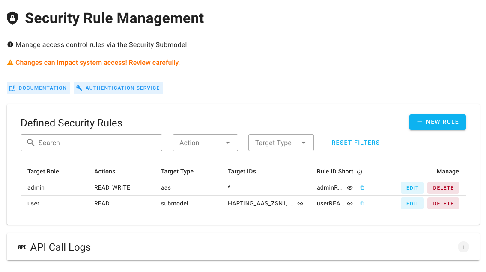

# Sicherheitsmodul (PRODUCTION)

## BaSyx Security Plugin Frontend – Dokumentation


Das Plugin musste einmal im MOCK und einmal im PRODUCTION modus geschrieben werden, da einige Funktionen mit echten API-Abfragen nicht funktioniert haben. Deshalb wurden auch zwei verschiedene Dokumente erstellt.


[sicherheitsmodul-production.md](sicherheitsmodul-production.md "mention") (Dieses Dokument)

[sicherheitsmodul-security.vue.md](sicherheitsmodul-security.vue.md "mention")

### 1. Einführung

Das BaSyx Security Plugin Frontend ist eine Vue.js-basierte Benutzeroberfläche, die in das BaSyx Web UI integriert wird. Es ermöglicht die Verwaltung von Sicherheitsregeln für BaSyx-Komponenten über eine intuitive grafische Oberfläche. Das Plugin kommuniziert mit dem BaSyx-Backend, um Regeln aus dem Security Submodel zu lesen und zu modifizieren.

#### 1.1 Hauptfunktionen

* **Anzeige bestehender Sicherheitsregeln**: Übersichtliche Darstellung aller im System definierten Regeln
* **Erstellung neuer Regeln**: Benutzerfreundliches Formular zur Definition von Zugriffsregeln
* **Bearbeitung bestehender Regeln**: Aktualisierung von Regelparametern ohne Neuanlage
* **Löschung von Regeln**: Entfernen nicht mehr benötigter Regeln mit Bestätigungsdialog
* **Suche und Filterung**: Durchsuchen und Filtern von Regeln nach verschiedenen Kriterien
* **API-Logging**: Detaillierte Protokollierung aller API-Aufrufe für Debugging-Zwecke

### 2. Benutzeroberfläche

#### 2.1 Hauptansicht

Die Hauptansicht des Security Plugins besteht aus:

* **Kopfbereich**: Titel, Informationstext und Links zur Dokumentation sowie zur Keycloak-Admin-Oberfläche
* **Regelübersicht**: Tabelle mit allen definierten Sicherheitsregeln und Such-/Filteroptionen
* **Aktionsschaltflächen**: Schaltflächen zum Hinzufügen, Bearbeiten und Löschen von Regeln
* **API-Protokoll**: Ausklappbarer Bereich mit Protokollen der API-Kommunikation

#### Screenshots

<figure><figcaption><p>Die Hauptansicht der UI</p></figcaption></figure>

<figure><figcaption><p>Ein Beispiel für die API Call Logs</p></figcaption></figure>

#### 2.2 Such- und Filterfunktionen

Die Regelübersicht bietet folgende Filteroptionen:

* **Textsuche**: Freitextsuche in allen Regelfeldern
* **Target Type Filter**: Filtern nach Ressourcentyp (AAS, Submodel, etc.)
* **Action Filter**: Filtern nach erlaubten Aktionen (READ, WRITE, etc.)
* **Zurücksetzen**: Zurücksetzen aller Filterkriterien

#### 2.3 Fehleranzeige in der UI

Das Frontend zeigt Fehler an mehreren Stellen an:

* **Fehler auf der Hauptseite**: Oben in der UI für allgemeine Probleme
* **Dialogfehler**: Im jeweiligen Dialogfenster
* **API-Protokolleinträge**: Detaillierte Informationen zu jedem API-Aufruf

#### 2.4 Dialoge

Das Plugin enthält drei Hauptdialoge:

1. **Neuer-Regel-Dialog**: Formular zum Erstellen einer neuen Sicherheitsregel
2. **Bearbeiten-Dialog**: Formular zum Aktualisieren einer bestehenden Regel
3. **Löschbestätigungsdialog**: Dialog zur Bestätigung des Löschens einer Regel

<figure><figcaption><p>Popup zur Definition einer neuen Sicherheitsregel</p></figcaption></figure>

### 3. Funktionalität

#### 3.1 Regeln anzeigen

Das Plugin lädt automatisch alle bestehenden Sicherheitsregeln aus dem Security Submodel und zeigt sie in einer Tabelle an:

* **Regel-ID Short**: Automatisch generierte ID (Base64-codiert)
* **Zielrolle**: Die Rolle, für die die Regel gilt
* **Aktionen**: Erlaubte Aktionen (READ, WRITE, DELETE, EXECUTE)
* **Zieltyp**: Typ der Zielressource (AAS, Submodel, etc.)
* **Verwaltungsoptionen**: Schaltflächen zum Bearbeiten und Löschen von Regeln

#### 3.2 Regeln erstellen

Beim Erstellen neuer Regeln bietet das System:

* Automatische Generierung der Regel-ID basierend auf Rolle, erster Aktion und Zieltyp
* Validierung der Eingabefelder mit Fehlermeldungen
* Multi-Select für Aktionen (READ, WRITE, DELETE, EXECUTE)
* Unterstützung für mehrere Ziel-IDs (eine pro Zeile)
* Wildcard-Unterstützung mit "\*" für alle Instanzen eines Typs

#### 3.3 Regeln bearbeiten

Das Plugin ermöglicht das Bearbeiten bestehender Regeln:

* Änderung von Zielrolle, Aktionen und Ziel-IDs
* Beibehaltung der ursprünglichen Regel-ID für Kontinuität
* Validierung aller Eingabefelder vor dem Speichern

#### 3.4 API-Protokolle

Das Frontend protokolliert alle API-Interaktionen im API-Protokollbereich:

* Zeitstempel der Aktion
* Art der Operation (Fetch, Create, Update, Delete)
* HTTP-Methode und Endpunkt
* Payload (bei POST/PUT-Anfragen)
* Ergebnis (Erfolg/Fehler mit Statuscode)
* Etwaige Fehlermeldungen
* Farbige Kennzeichnung für erfolgreiche und fehlgeschlagene Operationen

### 4. Technische Details

#### 4.1 Technologien

* **Vue.js**: JavaScript-Framework für die UI
* **TypeScript**: Für typsicheres Programmieren
* **Vuetify**: UI-Komponentenframework für Material Design
* **REST API**: Kommunikation mit dem BaSyx-Backend

#### 4.2 Regel-Datenstruktur

Eine Sicherheitsregel wird im Frontend als Vue-Objekt dargestellt, bevor sie in die AAS-Struktur umgewandelt wird:

```typescript
interface FormData {
  idShort: string;
  role: string;
  actions: string[];
  targetType: string;
  targetIds: string;
  targetElementPaths: string;
}
```

#### 4.3 Zieltyp-Mapping

Das Frontend ordnet benutzerfreundliche Typen Anzeigennamen für die UI und zur Generierung der Regel-ID zu:

```typescript
const targetInformationClassMap: Record<TargetType, string> = {
  'aas-registry': 'AAS-Registry',
  'aas': 'Asset Administration Shell',
  'submodel-registry': 'Submodel-Registry',
  'submodel': 'Submodel'
};
```

#### 4.4 Automatische ID-Generierung

Die Regel-ID Short wird automatisch generiert, indem eine Kombination aus:

```
Base64(Rolle + ErsteAktion + Zieltyp)
```

Base64-codiert wird. Dies stellt eindeutige, reproduzierbare IDs für jede Regelkonfiguration sicher.

#### 4.5 API-Endpunkte

Das Frontend interagiert mit folgenden API-Endpunkten:

* **GET** `/submodels/{SECURITY_SUBMODEL_B64_ID}`: Security Submodel abrufen
* **POST** `/submodels/{SECURITY_SUBMODEL_B64_ID}/submodel-elements`: Neue Regel erstellen
* **PUT** `/submodels/{SECURITY_SUBMODEL_B64_ID}/submodel-elements/{ruleIdShort}`: Regel aktualisieren
* **DELETE** `/submodels/{SECURITY_SUBMODEL_B64_ID}/submodel-elements/{ruleIdShort}`: Regel löschen

***

### Weitere Informationen

* Projekt-Repository: [https://github.com/DHBW-TINF23F/Team1-BaSyx-Security-Plugin](https://github.com/DHBW-TINF23F/Team1-BaSyx-Security-Plugin)
