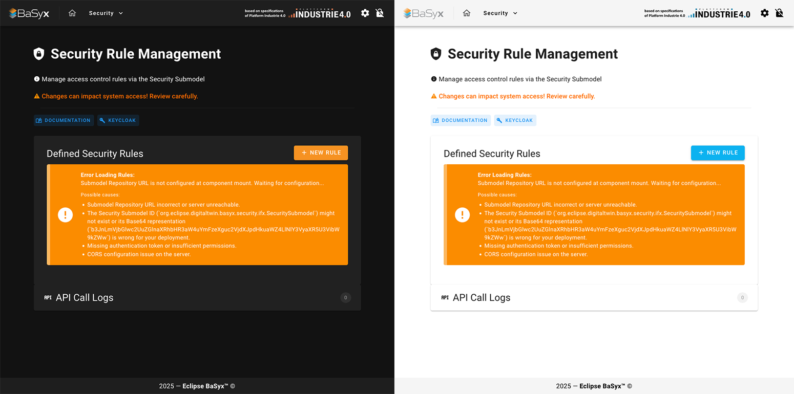

# Sicherheitsmodul (Security.vue)

## BaSyx Security Plugin Frontend - Dokumentation

### 1. Einführung

Das BaSyx Security Plugin Frontend ist eine Vue.js-basierte Benutzeroberfläche, die in das BaSyx Web UI integriert wird. Es ermöglicht die Verwaltung von Sicherheitsregeln für BaSyx-Komponenten über eine intuitive grafische Oberfläche. Das Plugin kommuniziert mit dem BaSyx-Backend, um Regeln aus dem Security Submodel zu lesen und zu modifizieren.

#### 1.1 Hauptfunktionen

* **Anzeige bestehender Sicherheitsregeln**: Übersichtliche Darstellung aller im System definierten Regeln
* **Erstellung neuer Regeln**: Benutzerfreundliches Formular zur Definition von Zugriffsregeln
* **Löschung von Regeln**: Entfernen nicht mehr benötigter Regeln mit Bestätigungsdialog
* **API-Logging**: Detaillierte Protokollierung aller API-Aufrufe für Debugging-Zwecke

### 2. Benutzeroberfläche

#### 2.1 Hauptansicht

Die Hauptansicht des Security Plugins besteht aus folgenden Elementen:

* **Header-Bereich**: Titel, Informationstext und Dokumentationslinks
* **Regelübersicht**: Tabelle mit allen definierten Sicherheitsregeln
* **Aktion-Buttons**: Schaltflächen zum Hinzufügen und Löschen von Regeln
* **API-Log**: Aufklappbarer Bereich mit Protokollen der API-Kommunikation

#### Screenshots

<figure><figcaption><p>Die Hauptansicht des Plugins im Dark- und Lightmode</p></figcaption></figure>

#### 2.2 UI-Fehleranzeigen

Das Frontend zeigt Fehler an mehreren Stellen an:

* **Hauptseiten-Fehler**: Werden oben in der UI angezeigt und betreffen allgemeine Probleme
* **Dialog-Fehler**: Werden in den jeweiligen Dialogen angezeigt
* **API-Log-Einträge**: Detaillierte Informationen zu jedem API-Aufruf

#### 2.3 Dialoge

Das Plugin enthält zwei Hauptdialoge:

1. **Neuer-Regel-Dialog**: Formular zur Erstellung einer neuen Sicherheitsregel
2. **Löschen-Bestätigungs-Dialog**: Dialog zur Bestätigung des Löschvorgangs einer Regel

<figure><figcaption><p>Popup, wenn einen neue Security Regel definiert werden soll</p></figcaption></figure>

### 3. Funktionalitäten

#### 3.1 Regeln anzeigen

Das Plugin lädt automatisch alle vorhandenen Sicherheitsregeln aus dem Security Submodel und zeigt sie in einer übersichtlichen Tabelle an:

* **Rule ID Short**: Automatisch generierte ID (Base64-kodiert)
* **Target Role**: Die Zielrolle, für die die Regel gilt
* **Actions**: Erlaubte Aktionen (READ, WRITE, DELETE, EXECUTE)
* **Target Type**: Typ der Zielressource (AAS, Submodel, etc.)
* **Verwaltungsoptionen**: Buttons zum Löschen von Regel

#### 3.2 API-Logs

Das Frontend protokolliert alle API-Interaktionen im API-Log-Bereich:

* Timestamp der Aktion
* Art der Operation (Fetch, Create, Delete)
* HTTP-Methode und Endpunkt
* Payload (bei POST-Anfragen)
* Ergebnis (Erfolg/Fehler mit Statuscode)
* Eventuelle Fehlermeldungen

### 4. Technische Details

#### 4.1 Technologien

* **Vue.js**: JavaScript-Framework für die UI
* **TypeScript**: Für typsichere Programmierung
* **Vuetify**: UI-Komponenten-Framework
* **REST API**: Kommunikation mit dem BaSyx Backend

#### 4.2 Datenstruktur einer Regel

Eine Sicherheitsregel wird im Frontend als Vue-Objekt repräsentiert, bevor sie in die AAS-Struktur umgewandelt wird:

```typescript
interface NewRuleData {
  role: string;            // Zielrolle
  actions: string[];       // Erlaubte Aktionen
  targetType: string;      // Ressourcentyp
  targetIds: string;       // Ziel-IDs (mehrzeilig)
}
```

#### 4.3 Target Type Mapping

Das Frontend mappt benutzerfreundliche Typen auf Java-Klassennamen für die Generierung der Rule ID:

```typescript
const targetInformationClassMap = {
  'aas-environment': 'org.eclipse.digitaltwin.basyx.aasenvironment.feature.authorization.AasEnvironmentTargetInformation',
  'aas': 'org.eclipse.digitaltwin.basyx.aasrepository.feature.authorization.AasTargetInformation',
  'submodel': 'org.eclipse.digitaltwin.basyx.submodelrepository.feature.authorization.SubmodelTargetInformation',
  'concept-description': 'org.eclipse.digitaltwin.basyx.conceptdescriptionrepository.feature.authorization.ConceptDescriptionTargetInformation',
  'aas-registry': 'org.eclipse.digitaltwin.basyx.aasregistry.feature.authorization.AasRegistryTargetInformation',
  'submodel-registry': 'org.eclipse.digitaltwin.basyx.submodelregistry.feature.authorization.SubmodelRegistryTargetInformation',
  'aas-discovery': 'org.eclipse.digitaltwin.basyx.aasdiscoveryservice.feature.authorization.AasDiscoveryServiceTargetInformation',
};
```

#### 4.4 API-Endpunkte

Das Frontend interagiert mit folgenden API-Endpunkten:

* **GET** `{submodelRepositoryUrl}/{SECURITY_SUBMODEL_B64_ID}`: Abrufen des Security Submodels
* **POST** `{submodelRepositoryUrl}/{SECURITY_SUBMODEL_B64_ID}/submodel-elements`: Erstellen einer neuen Regel
* **DELETE** `{submodelRepositoryUrl}/{SECURITY_SUBMODEL_B64_ID}/submodel-elements/{ruleIdShort}`: Löschen einer Regel

***

### Weiterführende Informationen

* Projektrepository: [https://github.com/DHBW-TINF23F/Team1-BaSyx-Security-Plugin](https://github.com/DHBW-TINF23F/Team1-BaSyx-Security-Plugin)
