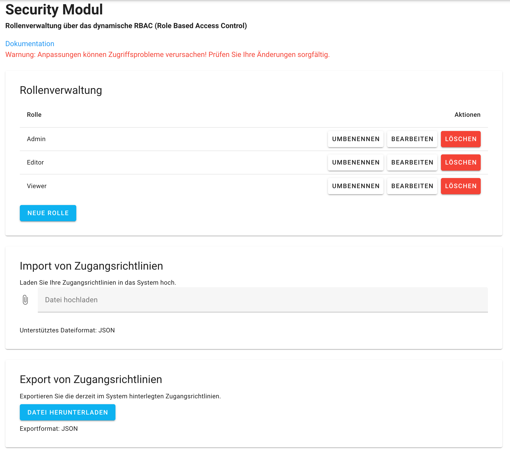

# Sicherheitsmodul (Security.vue)

Das Sicherheitsmodul dient zur Verwaltung von Rollen und Zugangsrichtlinien mithilfe von **Role-Based Access Control (RBAC)**. Es unterstützt die Erstellung, Bearbeitung und Löschung von Rollen sowie den Import und Export von Richtlinien und dokumentiert ausgeführte Aktionen.

***

### **Funktionen**

#### **1. Rollenverwaltung**

* **Rollen anzeigen**: Eine Tabelle listet bestehende Rollen übersichtlich auf
* **Aktionen für Rollen**:
  * **Neue Rolle erstellen**: Mit einem Klick wird eine Eingabeaufforderung geöffnet, in der der Name der neuen Rolle eingegeben wird
  * **Rolle umbenennen**: Der Name einer bestehenden Rolle kann geändert werden
  * **Rolle bearbeiten**: Bearbeitung vorhandener Rolleneinstellungen
  * **Rolle löschen**: Entfernt die Rolle nach Bestätigung

#### **2. Import von Zugangsrichtlinien**

* Über eine **Datei-Upload**-Funktion können **JSON-Dateien** hochgeladen werden, die neue Zugangsrichtlinien enthalten

#### **3. Export von Zugangsrichtlinien**

* Exportieren der vorhandenen Richtlinien als **JSON-Datei** für Sicherungs- oder Analysezwecke

### **Hinweise zur Nutzung**

* **Rollenanpassungen**: Änderungen an Rollen können Zugriffsprobleme verursachen – bitte sorgfältig prüfen

### Screenshot

<figure><figcaption>
Die UI des Security-Moduls
</figcaption></figure>

